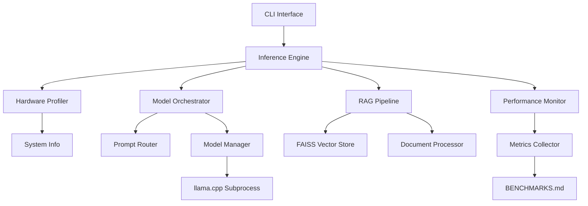

# Design Document

## Overview

The AURA-Engine-Core is architected as a modular, hardware-aware AI inference system built around three core phases of functionality. The system employs a layered architecture that separates concerns between hardware profiling, model orchestration, and retrieval augmentation while maintaining strict memory management and performance monitoring throughout.

The design prioritizes resource efficiency, modularity, and comprehensive observability to meet the project's mandate of demonstrating elite engineering capabilities.

## Architecture

### High-Level Architecture



### Component Hierarchy

1. **CLI Layer**: Entry point handling argument parsing and user interaction
2. **Engine Layer**: Core orchestration and workflow management
3. **Service Layer**: Specialized components for hardware, models, and RAG
4. **Infrastructure Layer**: External integrations (llama.cpp, FAISS, system APIs)

## Components and Interfaces

### 1. CLI Interface (`cli.py`)

**Responsibilities:**
- Parse command-line arguments using argparse
- Validate input parameters
- Initialize and coordinate the inference engine
- Handle top-level error reporting and exit codes

**Key Methods:**
```python
def parse_arguments() -> argparse.Namespace
def validate_inputs(args: argparse.Namespace) -> bool
def main() -> int
```

### 2. Inference Engine (`engine.py`)

**Responsibilities:**
- Orchestrate the complete inference workflow
- Coordinate between hardware profiling, model management, and RAG
- Manage the overall system lifecycle
- Aggregate performance metrics

**Key Methods:**
```python
def __init__(self, config: EngineConfig)
def initialize() -> None
def process_prompt(prompt: str, use_rag: bool = False) -> InferenceResult
def shutdown() -> None
```

### 3. Hardware Profiler (`hardware.py`)

**Responsibilities:**
- Detect system RAM using psutil
- Detect GPU VRAM using nvidia-smi XML parsing
- Calculate optimal GPU layer allocation for llama.cpp
- Provide fallback strategies for hardware detection failures

**Key Methods:**
```python
def detect_system_memory() -> int
def detect_gpu_memory() -> Optional[int]
def calculate_gpu_layers(model_size: int, available_vram: int) -> int
def get_hardware_profile() -> HardwareProfile
```

**Hardware Detection Strategy:**
- Primary: nvidia-smi XML parsing for NVIDIA GPUs
- Fallback: CPU-only execution if GPU detection fails
- Error handling: Graceful degradation with clear logging

### 4. Model Orchestrator (`orchestrator.py`)

**Responsibilities:**
- Route prompts to appropriate specialized models
- Manage model loading and unloading lifecycle
- Ensure exclusive model memory usage
- Track model switching performance

**Components:**

#### Prompt Router (`router.py`)
```python
def analyze_prompt(prompt: str) -> ModelType
def get_routing_keywords() -> Dict[ModelType, List[str]]
```

**Routing Logic:**
- Coding keywords: "function", "code", "python", "javascript", "debug", "implement"
- Writing keywords: "write", "essay", "story", "article", "explain", "describe"
- Default: General model for unmatched prompts

#### Model Manager (`model_manager.py`)
```python
def load_model(model_type: ModelType) -> None
def unload_current_model() -> None
def is_model_loaded() -> bool
def get_current_model() -> Optional[ModelType]
```

**Memory Management Strategy:**
- Explicit model unloading before loading new models
- Memory usage tracking during transitions
- Resource cleanup on process termination

### 5. RAG Pipeline (`rag.py`)

**Responsibilities:**
- Manage FAISS vector index operations
- Process document ingestion and chunking
- Retrieve relevant context for prompts
- Integrate retrieved context with prompts

**Components:**

#### Document Processor (`document_processor.py`)
```python
def chunk_document(content: str, chunk_size: int = 512) -> List[str]
def generate_embeddings(chunks: List[str]) -> np.ndarray
def create_index(embeddings: np.ndarray, chunks: List[str]) -> FAISSIndex
```

#### Vector Store (`vector_store.py`)
```python
def load_index(index_path: str) -> FAISSIndex
def search(query: str, k: int = 5) -> List[RetrievalResult]
def save_index(index: FAISSIndex, path: str) -> None
```

### 6. Performance Monitor (`performance.py`)

**Responsibilities:**
- Track Time-to-First-Token (TTFT)
- Measure Tokens per Second (TPS)
- Monitor memory usage (RAM/VRAM)
- Record model load times
- Generate benchmark reports

**Key Methods:**
```python
def start_inference_timer() -> None
def record_first_token() -> None
def record_completion(token_count: int) -> None
def track_memory_usage() -> MemoryMetrics
def generate_benchmark_entry() -> BenchmarkEntry
```

### 7. llama.cpp Integration (`llama_wrapper.py`)

**Responsibilities:**
- Construct llama.cpp command strings with optimal parameters
- Execute subprocess calls with proper stream handling
- Parse model output and error streams
- Handle llama.cpp-specific error conditions

**Key Methods:**
```python
def build_command(model_path: str, prompt: str, gpu_layers: int) -> List[str]
def execute_inference(command: List[str]) -> InferenceOutput
def parse_output(stdout: str, stderr: str) -> ProcessedOutput
```

## Data Models

### Core Data Structures

```python
@dataclass
class HardwareProfile:
    system_ram_mb: int
    gpu_vram_mb: Optional[int]
    gpu_name: Optional[str]
    optimal_gpu_layers: int
    cpu_cores: int

@dataclass
class InferenceResult:
    response: str
    metrics: PerformanceMetrics
    model_used: ModelType
    rag_context: Optional[str]

@dataclass
class PerformanceMetrics:
    ttft_ms: float
    tokens_per_second: float
    peak_ram_mb: int
    peak_vram_mb: int
    model_load_time_s: float

@dataclass
class BenchmarkEntry:
    date: str
    hardware: str
    phase: int
    scenario: str
    ttft_ms: float
    tps: float
    peak_vram_mb: int
    peak_ram_mb: int

enum ModelType:
    CODER = "coder"
    WRITER = "writer"
    GENERAL = "general"
```

### Configuration Management

```python
@dataclass
class EngineConfig:
    models_dir: str
    llama_cpp_path: str
    faiss_index_path: Optional[str]
    enable_benchmarking: bool
    log_level: str
    max_tokens: int
    temperature: float
```

## Error Handling

### Error Categories and Strategies

1. **Hardware Detection Errors**
   - nvidia-smi not found: Fall back to CPU-only execution
   - XML parsing failure: Use default GPU layer calculation
   - Insufficient memory: Prevent model loading with clear error message

2. **Model Management Errors**
   - Model file not found: List available models and exit gracefully
   - Model corruption: Validate model integrity before loading
   - Memory allocation failure: Clean up and retry with reduced parameters

3. **RAG Pipeline Errors**
   - FAISS index missing: Disable RAG and continue with standard inference
   - Document processing failure: Skip problematic documents with logging
   - Embedding generation failure: Fall back to keyword-based retrieval

4. **llama.cpp Integration Errors**
   - Binary not found: Provide installation instructions and exit
   - Subprocess timeout: Kill process and report timeout error
   - Invalid model format: Validate model compatibility before execution

### Error Recovery Mechanisms

```python
class ErrorHandler:
    def handle_hardware_error(self, error: HardwareError) -> HardwareProfile
    def handle_model_error(self, error: ModelError) -> None
    def handle_rag_error(self, error: RAGError) -> bool
    def handle_subprocess_error(self, error: SubprocessError) -> None
```

## Testing Strategy

### Unit Testing Approach

1. **Hardware Profiler Testing**
   - Mock psutil calls for different RAM configurations
   - Mock nvidia-smi subprocess calls with various XML outputs
   - Test GPU layer calculation logic with edge cases
   - Verify fallback behavior when hardware detection fails

2. **Model Orchestrator Testing**
   - Test prompt routing with comprehensive keyword sets
   - Verify model loading/unloading sequences
   - Mock subprocess calls to test model switching
   - Validate memory tracking during model transitions

3. **RAG Pipeline Testing**
   - Test document chunking with various text formats
   - Mock FAISS operations for retrieval testing
   - Verify context integration with prompts
   - Test error handling for missing indices

4. **Performance Monitor Testing**
   - Test timing calculations with mocked timestamps
   - Verify memory tracking accuracy
   - Test benchmark report generation
   - Validate metrics aggregation logic

### Integration Testing Framework

```python
class IntegrationTestSuite:
    def test_phase1_baseline_inference(self)
    def test_phase2_model_switching(self)
    def test_phase3_rag_integration(self)
    def test_error_recovery_scenarios(self)
    def test_performance_benchmarking(self)
```

### Test Data Management

- Mock hardware configurations for consistent testing
- Sample model files for integration testing
- Test document corpus for RAG validation
- Benchmark baseline data for performance regression testing

## Performance Considerations

### Memory Optimization

1. **Model Memory Management**
   - Explicit model unloading before loading new models
   - Memory usage monitoring during all operations
   - Resource cleanup on abnormal termination

2. **RAG Efficiency**
   - Lazy loading of FAISS indices
   - Efficient document chunking strategies
   - Optimized embedding generation and storage

### Scalability Design

1. **Modular Architecture**
   - Pluggable model backends beyond llama.cpp
   - Configurable routing strategies
   - Extensible performance monitoring

2. **Resource Management**
   - Configurable memory limits
   - Adaptive GPU layer calculation
   - Dynamic model selection based on available resources

### Monitoring and Observability

1. **Comprehensive Logging**
   - Structured logging with configurable levels
   - Performance metrics collection
   - Error tracking and reporting

2. **Benchmark Integration**
   - Automated benchmark data collection
   - Performance regression detection
   - Historical performance tracking